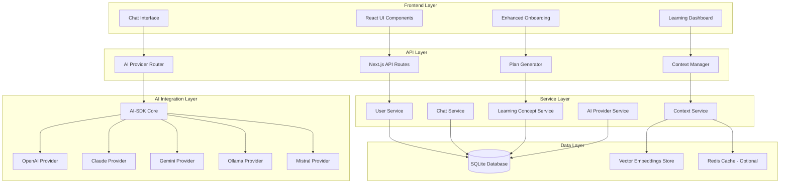
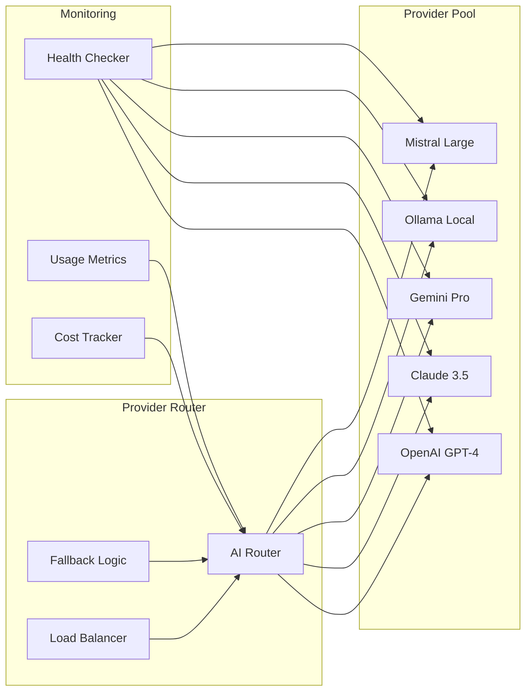

# Design Document

## Overview

The Multi-AI Context System transforms the learning platform into a sophisticated, multi-provider AI-powered tutoring system. It leverages AI-SDK for unified provider management, implements advanced context and memory management, and supports multiple concurrent learning concepts with intelligent cross-referencing capabilities.

The system builds upon the existing SQLite database architecture while introducing new tables and services for AI provider management, learning concepts, context storage, and enhanced user experience.

## Architecture

### High-Level Architecture



### AI Provider Management Architecture



## Components and Interfaces

### 1. AI Provider Management

#### AIProviderRouter
```typescript
interface AIProviderRouter {
  // Route requests to optimal provider
  route(request: AIRequest, context: UserContext): Promise<AIResponse>
  
  // Handle provider failures with fallback
  handleFailure(provider: string, error: Error): Promise<string>
  
  // Get provider health status
  getProviderHealth(): Promise<ProviderHealthStatus[]>
  
  // Update provider configurations
  updateProviderConfig(config: ProviderConfig): Promise<void>
}

interface AIRequest {
  userId: string
  conceptId?: string
  conversationId?: string
  messages: Message[]
  systemPrompt: string
  maxTokens?: number
  temperature?: number
  preferredProvider?: string
}

interface AIResponse {
  content: string
  provider: string
  model: string
  tokens: number
  cost?: number
  processingTime: number
}
```

#### ProviderConfig
```typescript
interface ProviderConfig {
  name: string
  enabled: boolean
  priority: number
  maxRequestsPerMinute: number
  maxCostPerDay: number
  models: string[]
  apiKey?: string
  baseUrl?: string
  healthCheckInterval: number
}
```

### 2. Learning Concept Management

#### LearningConcept
```typescript
interface LearningConcept {
  id: string
  userId: string
  name: string
  description: string
  category: string // 'programming', 'mathematics', 'language', etc.
  difficulty: 'beginner' | 'intermediate' | 'advanced'
  estimatedHours: number
  prerequisites: string[] // concept IDs
  learningObjectives: string[]
  customPrompts: ConceptPrompt[]
  isActive: boolean
  progress: ConceptProgress
  createdAt: Date
  updatedAt: Date
}

interface ConceptPrompt {
  type: 'system' | 'instruction' | 'example'
  content: string
  priority: number
}

interface ConceptProgress {
  completionPercentage: number
  currentModule: string
  timeSpent: number
  lastStudied: Date
  milestones: Milestone[]
}
```

### 3. Context and Memory Management

#### ContextManager
```typescript
interface ContextManager {
  // Build context for AI requests
  buildContext(userId: string, conceptId?: string): Promise<AIContext>
  
  // Store conversation context
  storeContext(conversationId: string, context: ConversationContext): Promise<void>
  
  // Retrieve relevant context using semantic search
  retrieveRelevantContext(query: string, userId: string, conceptId?: string): Promise<ContextChunk[]>
  
  // Compress context when approaching limits
  compressContext(context: AIContext): Promise<AIContext>
  
  // Generate context summary
  generateSummary(conversationId: string): Promise<string>
}

interface AIContext {
  userProfile: UserProfile
  learningHistory: LearningSession[]
  conceptContext?: ConceptContext
  conversationHistory: Message[]
  relevantKnowledge: ContextChunk[]
  systemPrompts: string[]
  totalTokens: number
}

interface ContextChunk {
  id: string
  content: string
  embedding: number[]
  metadata: {
    type: 'conversation' | 'progress' | 'concept' | 'feedback'
    conceptId?: string
    timestamp: Date
    relevanceScore: number
  }
}
```

### 4. Enhanced Onboarding System

#### OnboardingManager
```typescript
interface OnboardingManager {
  // Start flexible onboarding process
  startOnboarding(userId: string): Promise<OnboardingSession>
  
  // Generate personalized learning plans
  generateLearningPlan(userId: string, concepts: string[]): Promise<LearningPlan>
  
  // Allow concept selection modification
  updateConceptSelection(userId: string, concepts: string[]): Promise<void>
  
  // Complete onboarding with or without concept selection
  completeOnboarding(userId: string, data: OnboardingData): Promise<void>
}

interface LearningPlan {
  id: string
  userId: string
  concepts: PlannedConcept[]
  schedule: StudySchedule
  adaptiveSettings: AdaptiveSettings
  generatedAt: Date
}

interface PlannedConcept {
  conceptId: string
  estimatedDuration: number
  weeklyHours: number
  milestones: PlanMilestone[]
  dependencies: string[]
}
```

## Data Models

### New Database Tables

#### AI Providers Table
```sql
CREATE TABLE ai_providers (
  id TEXT PRIMARY KEY,
  name TEXT NOT NULL,
  type TEXT NOT NULL, -- 'openai', 'claude', 'gemini', 'ollama', 'mistral'
  enabled BOOLEAN DEFAULT true,
  priority INTEGER DEFAULT 1,
  config TEXT, -- JSON configuration
  health_status TEXT DEFAULT 'unknown',
  last_health_check TEXT,
  total_requests INTEGER DEFAULT 0,
  total_cost REAL DEFAULT 0,
  created_at TEXT DEFAULT (datetime('now')),
  updated_at TEXT DEFAULT (datetime('now'))
);
```

#### Learning Concepts Table
```sql
CREATE TABLE learning_concepts (
  id TEXT PRIMARY KEY,
  user_id TEXT NOT NULL REFERENCES users(id) ON DELETE CASCADE,
  name TEXT NOT NULL,
  description TEXT,
  category TEXT NOT NULL,
  difficulty TEXT NOT NULL,
  estimated_hours INTEGER,
  prerequisites TEXT, -- JSON array
  learning_objectives TEXT, -- JSON array
  custom_prompts TEXT, -- JSON array
  is_active BOOLEAN DEFAULT true,
  completion_percentage REAL DEFAULT 0,
  current_module TEXT,
  time_spent REAL DEFAULT 0,
  last_studied TEXT,
  created_at TEXT DEFAULT (datetime('now')),
  updated_at TEXT DEFAULT (datetime('now'))
);
```

#### Context Embeddings Table
```sql
CREATE TABLE context_embeddings (
  id TEXT PRIMARY KEY,
  user_id TEXT NOT NULL REFERENCES users(id) ON DELETE CASCADE,
  concept_id TEXT REFERENCES learning_concepts(id) ON DELETE CASCADE,
  conversation_id TEXT REFERENCES conversations(id) ON DELETE CASCADE,
  content TEXT NOT NULL,
  embedding BLOB, -- Vector embedding
  metadata TEXT, -- JSON metadata
  relevance_score REAL,
  created_at TEXT DEFAULT (datetime('now'))
);
```

#### Learning Plans Table
```sql
CREATE TABLE learning_plans (
  id TEXT PRIMARY KEY,
  user_id TEXT NOT NULL REFERENCES users(id) ON DELETE CASCADE,
  name TEXT NOT NULL,
  description TEXT,
  concepts TEXT NOT NULL, -- JSON array of concept configurations
  schedule TEXT, -- JSON schedule configuration
  adaptive_settings TEXT, -- JSON adaptive learning settings
  is_active BOOLEAN DEFAULT true,
  created_at TEXT DEFAULT (datetime('now')),
  updated_at TEXT DEFAULT (datetime('now'))
);
```

#### AI Request Logs Table
```sql
CREATE TABLE ai_request_logs (
  id TEXT PRIMARY KEY,
  user_id TEXT REFERENCES users(id) ON DELETE CASCADE,
  conversation_id TEXT REFERENCES conversations(id) ON DELETE CASCADE,
  concept_id TEXT REFERENCES learning_concepts(id) ON DELETE CASCADE,
  provider TEXT NOT NULL,
  model TEXT NOT NULL,
  prompt_tokens INTEGER,
  completion_tokens INTEGER,
  total_tokens INTEGER,
  cost REAL,
  response_time INTEGER, -- milliseconds
  success BOOLEAN DEFAULT true,
  error_message TEXT,
  created_at TEXT DEFAULT (datetime('now'))
);
```

### Enhanced Existing Tables

#### Updated Conversations Table
```sql
-- Add new columns to existing conversations table
ALTER TABLE conversations ADD COLUMN concept_id TEXT REFERENCES learning_concepts(id);
ALTER TABLE conversations ADD COLUMN ai_provider TEXT;
ALTER TABLE conversations ADD COLUMN context_summary TEXT;
ALTER TABLE conversations ADD COLUMN total_cost REAL DEFAULT 0;
```

#### Updated Messages Table
```sql
-- Add new columns to existing messages table
ALTER TABLE messages ADD COLUMN concept_id TEXT REFERENCES learning_concepts(id);
ALTER TABLE messages ADD COLUMN context_used TEXT; -- JSON context metadata
ALTER TABLE messages ADD COLUMN cost REAL;
ALTER TABLE messages ADD COLUMN processing_time INTEGER;
```

## Error Handling

### AI Provider Failure Handling
```typescript
class AIProviderErrorHandler {
  async handleProviderError(error: AIProviderError): Promise<AIResponse> {
    switch (error.type) {
      case 'RATE_LIMIT':
        return this.handleRateLimit(error)
      case 'API_KEY_INVALID':
        return this.handleAuthError(error)
      case 'MODEL_UNAVAILABLE':
        return this.handleModelError(error)
      case 'TIMEOUT':
        return this.handleTimeout(error)
      default:
        return this.handleGenericError(error)
    }
  }
  
  private async handleRateLimit(error: AIProviderError): Promise<AIResponse> {
    // Implement exponential backoff and provider switching
    const nextProvider = await this.getNextAvailableProvider(error.provider)
    if (nextProvider) {
      return this.retryWithProvider(nextProvider, error.request)
    }
    throw new Error('All providers rate limited')
  }
}
```

### Context Management Error Handling
```typescript
class ContextErrorHandler {
  async handleContextError(error: ContextError): Promise<void> {
    switch (error.type) {
      case 'CONTEXT_TOO_LARGE':
        await this.compressContext(error.context)
        break
      case 'EMBEDDING_FAILED':
        await this.fallbackToKeywordSearch(error.query)
        break
      case 'STORAGE_FULL':
        await this.archiveOldContext(error.userId)
        break
    }
  }
}
```

## Testing Strategy

### Unit Testing
- AI Provider Router logic
- Context compression algorithms
- Learning plan generation
- Vector embedding operations
- Database service methods

### Integration Testing
- AI-SDK provider integrations
- Database operations with new schema
- Context retrieval and storage
- Multi-concept learning flows
- Onboarding process variations

### Performance Testing
- Context retrieval speed with large datasets
- AI provider response times
- Vector similarity search performance
- Concurrent user handling
- Memory usage optimization

### End-to-End Testing
- Complete onboarding flows
- Multi-concept learning sessions
- Provider failover scenarios
- Context persistence across sessions
- Cross-concept knowledge integration

## Security Considerations

### API Key Management
- Secure storage of provider API keys
- Environment-based configuration
- Key rotation capabilities
- Access logging and monitoring

### Data Privacy
- User context data encryption
- Conversation history protection
- Learning progress anonymization options
- GDPR compliance for data retention

### Rate Limiting and Abuse Prevention
- Per-user request limits
- Cost threshold monitoring
- Suspicious activity detection
- Provider quota management

## Performance Optimization

### Caching Strategy
- Context embedding caching
- Provider response caching
- User profile caching
- Learning plan caching

### Database Optimization
- Indexed queries for context retrieval
- Efficient vector similarity search
- Connection pooling
- Query optimization for multi-concept operations

### Memory Management
- Context compression algorithms
- Intelligent context pruning
- Efficient embedding storage
- Garbage collection for old contexts

## Monitoring and Analytics

### Provider Monitoring
- Response time tracking
- Error rate monitoring
- Cost tracking per provider
- Usage pattern analysis

### User Experience Monitoring
- Learning session analytics
- Context relevance scoring
- User satisfaction metrics
- Progress tracking across concepts

### System Health Monitoring
- Database performance metrics
- Memory usage tracking
- API response times
- Error logging and alerting