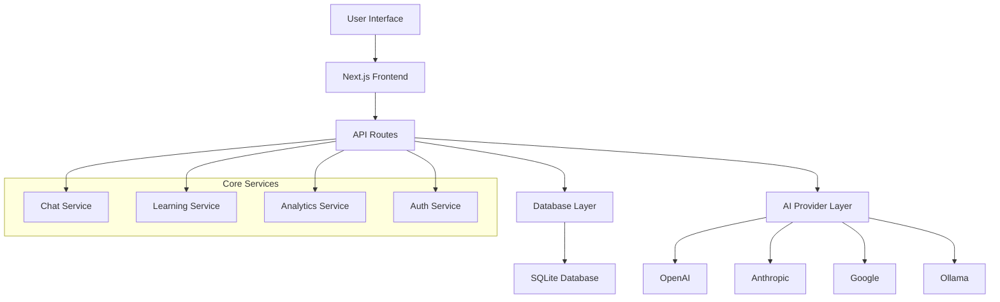

# 🚀 TayyarAI - AI-Powered Interview Preparation Platform

<div align="center">


**The most advanced AI-powered interview preparation platform for developers**

[](https://opensource.org/licenses/MIT)
[](https://typescriptlang.org)
[](https://nextjs.org)
[](https://tailwindcss.com)

[🌟 Features](#-features) • [🚀 Quick Start](#-quick-start) • [📚 Documentation](#-documentation) • [🤝 Contributing](#-contributing)

</div>

## 🌟 Features

### 🤖 Multi-AI Provider Support
- **7 AI Providers**: OpenAI, Anthropic, Google, Mistral, Ollama, Groq, Perplexity
- **Automatic Failover**: Seamless switching between providers
- **Cost Optimization**: Smart routing based on cost and performance
- **Health Monitoring**: Real-time provider status tracking

### 🎯 Personalized Learning
- **AI-Generated Plans**: Custom learning paths based on your goals
- **Adaptive Difficulty**: Adjusts based on your progress
- **Concept Management**: Organize learning into manageable concepts
- **Progress Tracking**: Comprehensive analytics and milestones

### 💬 Interactive AI Tutoring
- **Context-Aware Chat**: Maintains conversation context across sessions
- **Multi-Concept Support**: Switch between learning topics seamlessly
- **Real-Time Responses**: Fast, intelligent responses from multiple AI models
- **Code Review**: Get feedback on your code implementations

### 📊 Advanced Analytics
- **Learning Progress**: Track completion rates and time spent
- **Performance Insights**: Identify strengths and areas for improvement
- **Cost Monitoring**: Track AI usage and costs
- **System Health**: Monitor platform performance

### 🛠️ Developer-Friendly
- **Open Source**: MIT licensed, fully customizable
- **Modern Stack**: Next.js 15, TypeScript, Tailwind CSS
- **Comprehensive API**: RESTful API with full documentation
- **Easy Deployment**: Docker support, one-click deployments

## 🚀 Quick Start

### Prerequisites

- Node.js 18+ and npm
- Git

### Installation

1. **Clone the repository**
```bash
git clone https://github.com/tayyarai/tayyarai.git
cd tayyarai
```

2. **Install dependencies**
```bash
npm install
```

3. **Set up environment variables**
```bash
cp .env.example .env.local
```

Edit `.env.local`:
```env
# Database
DATABASE_URL="file:./data/app.db"

# Authentication
NEXTAUTH_SECRET="your-secret-key"

# AI Providers (add your API keys)
OPENAI_API_KEY="sk-..."
ANTHROPIC_API_KEY="sk-ant-..."
GOOGLE_API_KEY="AIza..."
```

4. **Initialize database**
```bash
npm run db:push
npm run db:seed
```

5. **Start development server**
```bash
npm run dev
```

Visit [http://localhost:3000](http://localhost:3000) 🎉

## 🏗️ Architecture



## 📱 Screenshots

<div align="center">

### 🎨 Modern UI Design


### 💬 AI Chat Interface


### 📊 Analytics Dashboard


### ⚙️ Admin Panel


</div>

## 🎯 Use Cases

### For Job Seekers
- **Interview Preparation**: Practice coding, system design, and behavioral questions
- **Skill Assessment**: Identify knowledge gaps and focus areas
- **Progress Tracking**: Monitor improvement over time
- **Mock Interviews**: Simulate real interview scenarios

### For Educators
- **Course Creation**: Build structured learning paths
- **Student Monitoring**: Track student progress and engagement
- **Content Management**: Organize learning materials and concepts
- **Performance Analytics**: Analyze learning outcomes

### For Companies
- **Employee Training**: Upskill development teams
- **Interview Process**: Standardize technical assessments
- **Knowledge Base**: Create internal learning resources
- **Team Analytics**: Monitor team learning progress

## 🛠️ Tech Stack

### Frontend
- **Next.js 15** - React framework with App Router
- **TypeScript** - Type-safe JavaScript
- **Tailwind CSS** - Utility-first CSS framework
- **Framer Motion** - Animation library

### Backend
- **Next.js API Routes** - Serverless API endpoints
- **Drizzle ORM** - Type-safe database toolkit
- **SQLite** - Lightweight database
- **AI SDK** - Multi-provider AI integration

### AI Integration
- **OpenAI** - GPT models
- **Anthropic** - Claude models
- **Google** - Gemini models
- **Mistral** - Mistral models
- **Ollama** - Local models
- **Groq** - Fast inference
- **Perplexity** - Search-augmented AI

### Development
- **ESLint** - Code linting
- **Prettier** - Code formatting
- **Jest** - Testing framework
- **Docker** - Containerization

## 📚 Documentation

Comprehensive documentation is available at [docs.tayyarai.com](https://docs.tayyarai.com)

- **[Getting Started](docs/docs/intro.md)** - Quick start guide
- **[API Reference](docs/docs/api/overview.md)** - Complete API documentation
- **[Development Guide](docs/docs/development/setup.md)** - Development setup and workflow
- **[Deployment Guide](docs/docs/deployment/overview.md)** - Production deployment
- **[Contributing Guide](docs/docs/contributing.md)** - How to contribute

## 🚀 Deployment

### Docker

```bash
# Build and run with Docker
docker build -t tayyarai .
docker run -p 3000:3000 tayyarai
```

### Vercel

[](https://vercel.com/new/clone?repository-url=https://github.com/tayyarai/tayyarai)

### Railway

[](https://railway.app/template/tayyarai)

### Manual Deployment

```bash
# Build for production
npm run build

# Start production server
npm start
```

## 🧪 Testing

```bash
# Run all tests
npm test

# Run with coverage
npm run test:coverage

# Run integration tests
npm run test:integration

# Run E2E tests
npm run test:e2e
```

## 📊 Performance

- **⚡ Fast**: Sub-second response times
- **📱 Responsive**: Works on all devices
- **🔄 Reliable**: 99.9% uptime with failover
- **💰 Cost-Effective**: Optimized AI usage

## 🤝 Contributing

We welcome contributions! Please see our [Contributing Guide](CONTRIBUTING.md) for details.

### Development Process

1. Fork the repository
2. Create a feature branch: `git checkout -b feature/amazing-feature`
3. Make your changes
4. Add tests for new functionality
5. Run the test suite: `npm test`
6. Commit your changes: `git commit -m 'Add amazing feature'`
7. Push to the branch: `git push origin feature/amazing-feature`
8. Open a Pull Request

### Code of Conduct

Please read our [Code of Conduct](CODE_OF_CONDUCT.md) to understand our community guidelines.

## 📄 License

This project is licensed under the MIT License - see the [LICENSE](LICENSE) file for details.

## 🙏 Acknowledgments

- **AI Providers** - OpenAI, Anthropic, Google, Mistral, and others
- **Open Source Community** - For the amazing tools and libraries
- **Contributors** - Everyone who has contributed to this project

## 📞 Support

- **Documentation**: [docs.tayyarai.com](https://docs.tayyarai.com)
- **Issues**: [GitHub Issues](https://github.com/tayyarai/tayyarai/issues)
- **Discord**: [Join our community](https://discord.gg/tayyarai)
- **Email**: [support@tayyarai.com](mailto:support@tayyarai.com)

## 🌟 Star History

[](https://star-history.com/#tayyarai/tayyarai&Date)

---

<div align="center">

**Made with ❤️ by the TayyarAI team**

[Website](https://tayyarai.com) • [Documentation](https://docs.tayyarai.com) • [Discord](https://discord.gg/tayyarai) • [Twitter](https://twitter.com/tayyarai)

</div>