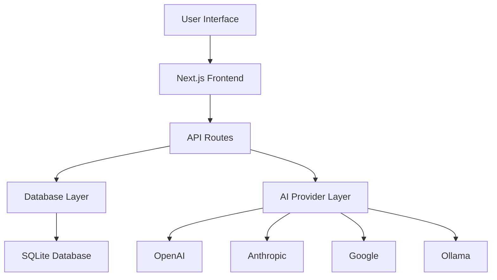

# Welcome to TayyarAI

**TayyarAI** is an advanced AI-powered interview preparation platform that helps developers prepare for technical interviews with personalized learning paths, multi-AI provider support, and comprehensive progress tracking.

## 🚀 Key Features

- **Multi-AI Provider Support**: Integrate with OpenAI, Anthropic, Google, Mistral, Ollama, Groq, and Perplexity
- **Personalized Learning Plans**: AI-generated learning paths based on your experience and goals
- **Real-time Chat**: Interactive AI tutoring with context awareness
- **Progress Tracking**: Comprehensive analytics and milestone tracking
- **Concept Management**: Organize learning into manageable concepts
- **Admin Dashboard**: Monitor system health, costs, and usage

## 🏗️ Architecture Overview

TayyarAI is built with modern technologies:

- **Frontend**: Next.js 15 with TypeScript and Tailwind CSS
- **Backend**: Next.js API routes with SQLite database
- **AI Integration**: AI SDK with multiple provider support
- **Authentication**: Custom session-based auth
- **Database**: Drizzle ORM with SQLite

## 🎯 Getting Started

1. **[Installation](./development/setup.md)** - Set up your development environment
2. **[Configuration](./development/configuration.md)** - Configure AI providers and settings
3. **[API Reference](./api/overview.md)** - Explore the API endpoints
4. **[UI Components](./ui/components.md)** - Learn about the component library

## 📚 Core Concepts

### Learning Concepts
Organize your learning into manageable concepts with prerequisites, progress tracking, and AI-powered recommendations.

### Multi-AI Context System
Switch between different AI providers seamlessly while maintaining conversation context and learning progress.

### Adaptive Learning Plans
AI-generated learning plans that adapt based on your progress, preferences, and goals.

## 🛠️ For Developers

- **[Development Setup](./development/setup.md)** - Get started with development
- **[API Integration](./api/integration.md)** - Learn how to integrate with the APIs
- **[Component Development](./ui/development.md)** - Build custom UI components
- **[Testing Guide](./development/testing.md)** - Write and run tests

## 🤝 Contributing

We welcome contributions! Please see our [Contributing Guide](./contributing.md) for details on how to get started.

## 📄 License

TayyarAI is open source software licensed under the [MIT License](https://github.com/tayyarai/tayyarai/blob/main/LICENSE).